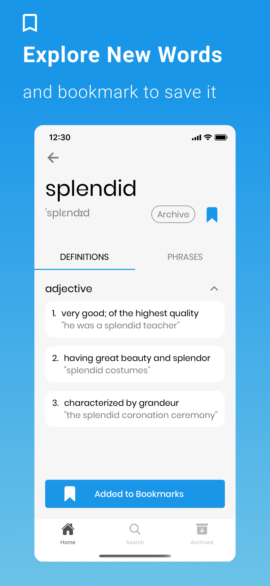
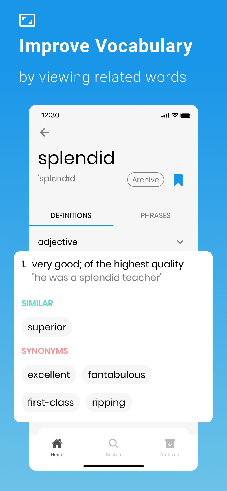
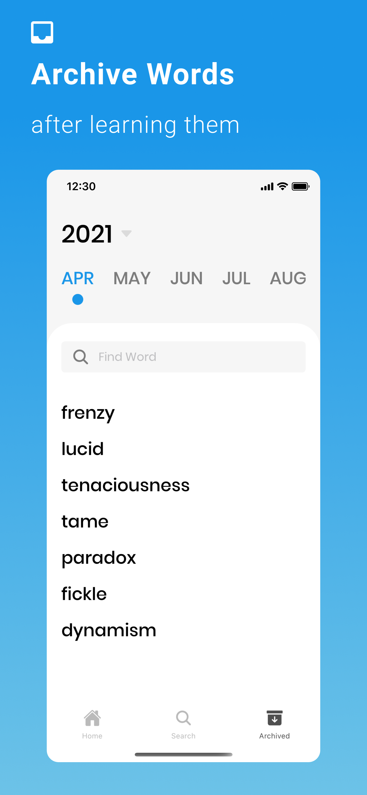
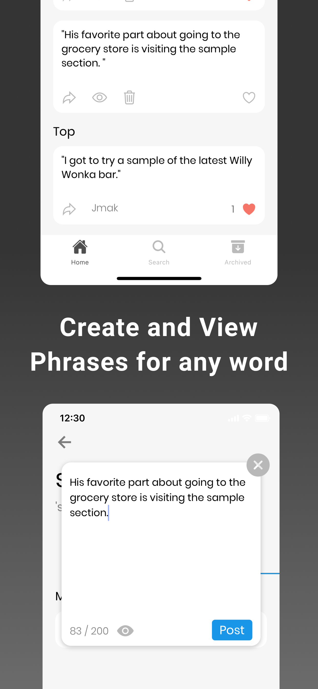
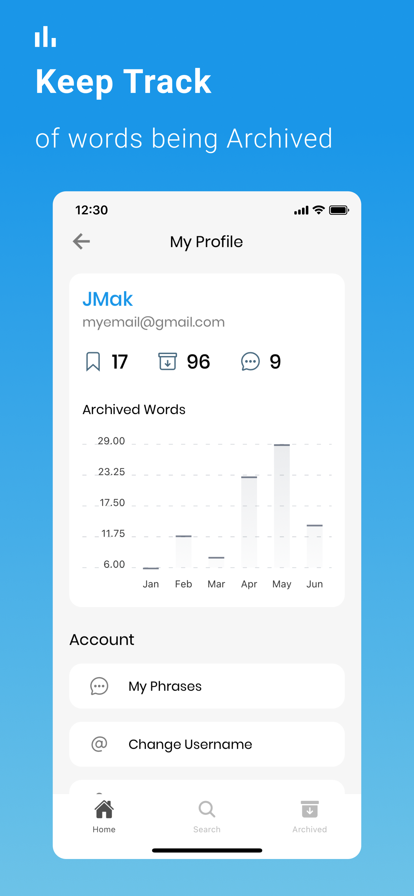

# Vocabular

How often do we stumble on words that escape our minds? Vocabular is an all-in one pocket dictionary to store collection of words that you encounter on a daily. It strives to help with retaining the meaning of words as you learn them. 

**What is Vocabular?**

Vocabular offers a clean and uncluttered interface that allows you to simply lookup, add, and archive words on your phone, changing the way you lookup words and retaining the meaning of them. Vocabular is your simple ad-free solution to learning new words and expanding your vocabulary. Whether you're looking to expand your vocabulary or keep track of words you've learnt, Vocabular aims to be your everyday pocket dictionary.

**What does Bookmarking a word do?**

Bookmarking a word will add it to your home screen and save it to your device (making it accessible offline). This gives you the ability to revisit words that you're familiarizing or learning.

**What is the Archive section for?**

When a bookmarked word is no longer of interest to you, you can have it moved into the archive section. Words that have been archived will be retrievable based on the year / month of when it was archived.

**What are Phrases?**

Phrases are sentences containing a particular word. Phrases should provide you with better context of how a word is used in a sentence. Create and view phrases for words you are learning to improve your understanding of a word. You can make your phrases public or private (account required).

  
  
  
  
  

